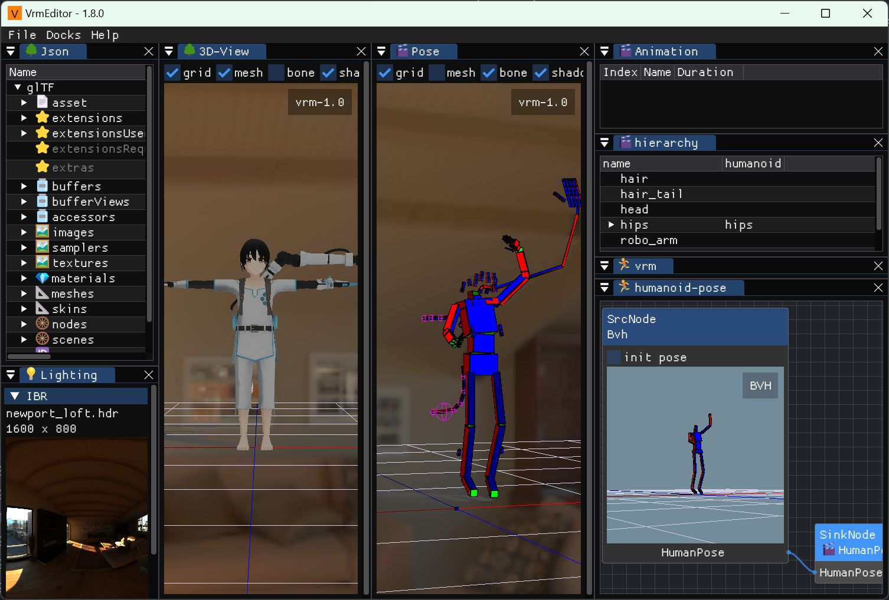

# vrmeditor

read, write, edit and animation test.



## features

- [x] glTF-2.0
- [x] bvh
- [ ] fbx

### glTF Extensions

- [ ] KHR_draco_mesh_compression
- [ ] [KHR_lights_punctual](https://github.com/KhronosGroup/glTF/tree/main/extensions/2.0/Khronos/KHR_lights_punctual)
- [ ] KHR_materials_clearcoat
- [ ] [KHR_materials_emissive_strength](https://github.com/KhronosGroup/glTF/tree/main/extensions/2.0/Khronos/KHR_materials_emissive_strength)
- [ ] KHR_materials_ior
- [ ] KHR_materials_iridescence
- [ ] KHR_materials_sheen
- [ ] KHR_materials_specular
- [ ] KHR_materials_transmission
- [x] [KHR_materials_unlit](https://github.com/KhronosGroup/glTF/tree/main/extensions/2.0/Khronos/KHR_materials_unlit)
- [ ] KHR_materials_variants
- [ ] KHR_materials_volume
- [ ] KHR_mesh_quantization
- [ ] KHR_texture_basisu
- [ ] [KHR_texture_transform](https://github.com/KhronosGroup/glTF/tree/main/extensions/2.0/Khronos/KHR_texture_transform)
- [ ] KHR_xmp_json_ld
- [x] [VRM](https://github.com/vrm-c/vrm-specification/tree/master/specification/0.0)
- [x] [VRMC_vrm](https://github.com/vrm-c/vrm-specification/tree/master/specification/VRMC_vrm-1.0)
- [x] [VRMC_springBone](https://github.com/vrm-c/vrm-specification/tree/master/specification/VRMC_springBone-1.0)
- [x] [VRMC_node_constraint](https://github.com/vrm-c/vrm-specification/tree/master/specification/VRMC_node_constraint-1.0)
- [x] [VRMC_materials_mtoon](https://github.com/vrm-c/vrm-specification/tree/master/specification/VRMC_materials_mtoon-1.0)
- [ ] [VRMC_vrm_animation](https://github.com/vrm-c/vrm-specification/tree/master/specification/VRMC_vrm_animation-1.0)

## Memo

```
        +------------+
        | Renderer   |
        +------------+
  drawlilst ^
            |
        +------------+
        |libvrm scene| <- Skinning/MorphTarget/Pose/Animation
        +------------+
     import ^|
            |v export
        +--------+
        |gltfjson| <- json dom tree: ImGui Edit
        +--------+
deserialize ^|
            |v serialize
        gltf/glb
```

## milestone

### 1

- [x] read / write vrm-0.x & 1.0

### 2

- [ ] edit all json node

### x

- fbx import
- vrma export
- motion merge
- pbr material
- mtoon material
- keyframe edit

## dependencies

- [imgui](https://github.com/ocornut/imgui)
  - [ImGuizmo](https://github.com/CedricGuillemet/ImGuizmo)
  - [ImGuiFileDialog](https://github.com/dfranx/ImFileDialog)
  - [ImNodes](https://github.com/Nelarius/imnodes)
- [glfw3](https://www.glfw.org/)
- [glew](https://github.com/nigels-com/glew)
- [DirectXMath](https://github.com/microsoft/DirectXMath)
- [lua-jit](https://luajit.org/)
- [stb](https://github.com/nothings/stb)
- [IconFontCppHeaders](https://github.com/juliettef/IconFontCppHeaders)
- [asio](https://think-async.com/Asio/)
- [simplefilewatcher](https://code.google.com/archive/p/simplefilewatcher/)
- [plog](https://github.com/SergiusTheBest/plog)

### test

- [googletest](https://github.com/google/googletest)

### shaders

- PBR: https://github.com/JoeyDeVries/LearnOpenGL/tree/master/src/6.pbr/2.2.2.ibl_specular_textured
- PBR/Unlit: https://github.com/KhronosGroup/glTF-Sample-Viewer
- MToon: https://github.com/pixiv/three-vrm
  - depends: https://github.com/mrdoob/three.js/tree/r150 (r150 required)

### subprojects

- [gltfjson](https://github.com/ousttrue/gltfjson) (JSON utility)
- [grapho](https://github.com/ousttrue/grapho) (OpenGL/Imgui wrapper)
- [cuber](https://github.com/ousttrue/cuber) (bone draw helper)

## build

|                  | msvc17      | clang16          |          |
| ---------------- | ----------- | ---------------- | -------- |
| std::spanstream  |             |                  | not used |
| std::expected    | `c++latest` | `c++2b` `libc++` | OK       |
| std::format      | `c++latest` |                  | removed  |
| std::span        | `c++latest` | `c++20`          | OK       |
| std::string_view | `c++latest` | `c++20`          | OK       |
| std::filesystem  | `c++latest` | `c++20`          | OK       |
| std::optional    | `c++latest` | `c++20`          | OK       |

```
# msvc17
$ meson setup builddir -Dcpp_std=c++latest -Dexecutable=true
$ meson compile -C builddir
```

```
# clang16 on Ubuntu22.04
$ meson setup builddir -Dcpp_std=c++2b -Dexecutable=true
$ meson compile -C builddir
```

## naming plan

- formatter clang-format: mozilla
- class, struct name PascalCase => camelCase. conflict public member name
- free function: lower_snake
- non public memver function: lower_snake

### variables

Naming conventions for variables with a wider scope than local variables.

- local variable: camelCase
- public member: PascalCase
- non public member variable: prefix `m_`
- static variable: prefix `s_`
- global variable: prefix `g_`
- const, enum value: UPPER_SNAKE
- enum class value: Pascal

### folder / namespace

#### libvrm

node & morphtarget

animation / springbone / constraint

##### humanoid

udp / bvh

#### boneskin

boneskinning

mesh / skinning / deformed_mesh

#### namespace

- `libvrm` (Node hierarchy / BaseMesh)
- `libvrm::vrm` (Humanoid, Expression, SpringBone, Constraint, LookAt)
- `libvrm::vrma`
- `libvrm::bvh`
- `libvrm::runtime` (NodeAnimation, MorphTarget, Skinning)
- `libvrm::serialization` (Udp pose)
