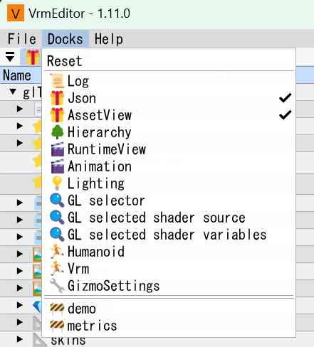

# docks

各画面の説明

`v1.9.0`

## menu-docks

* Reset 配置を初期化します。

{w=300px align=center}

```{toctree}
logger.md
asset/index.md
runtime/index.md
hierarchy.md
lighting.md
GL_selector.md
GL_source.md
GL_variable.md
```
