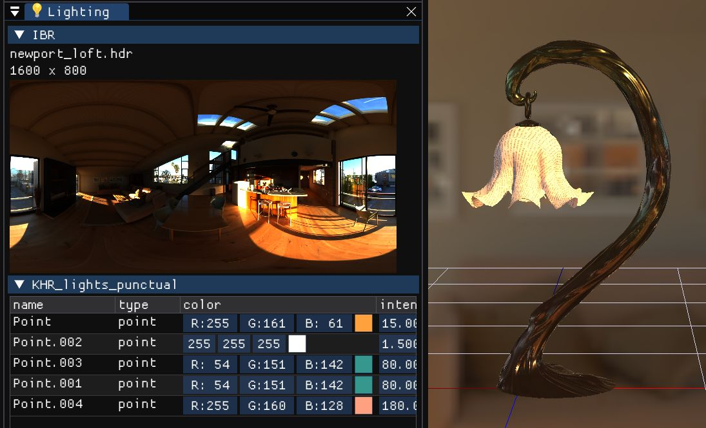

# 💡Lighting.md

光源設定です。

:::{note}
PBR と MToon で別の Shader を使っているため、
効き方が異なります。
:::

{w=600px align=center}

- hdr 画像をロードできます

## default

- directional light 一灯

## KHR_lights_punctual 拡張

https://github.com/KhronosGroup/glTF/blob/main/extensions/2.0/Khronos/KHR_lights_punctual/README.md

伝統的な `directional`, `point`, `spot` ライトです。
デフォルトの directional light を置き換えます

## hdr 画像

- IBL を追加します。PBR (materialのみ有効)
